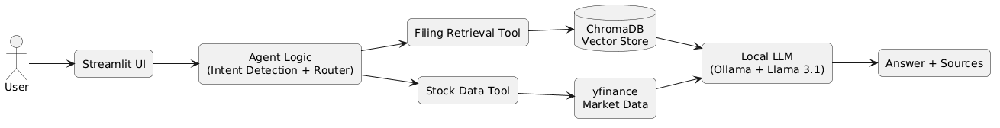
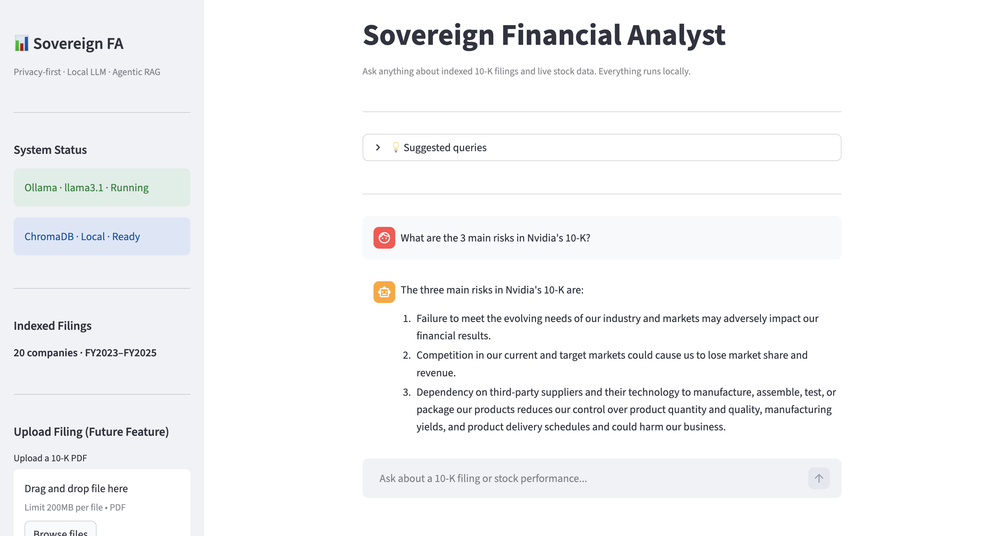
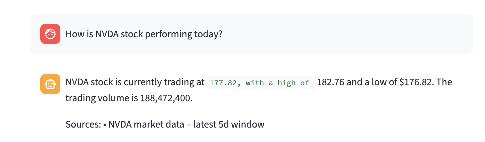
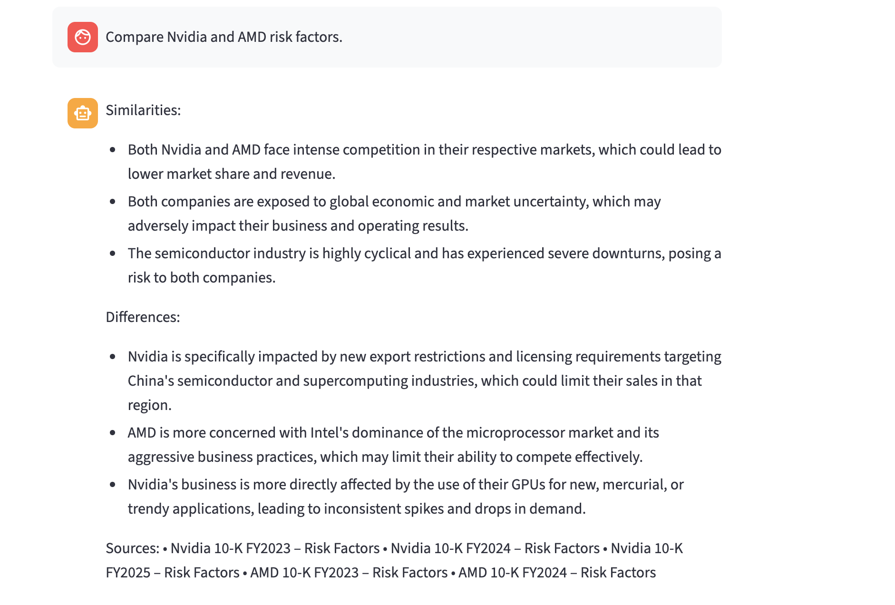

# 📊 Sovereign Financial Analyst

**Sovereign Financial Analyst** is a **local AI financial research assistant** that analyzes **SEC 10-K filings** and **live stock data** using an **agentic Retrieval-Augmented Generation (RAG) system**.

The system allows users to ask natural language questions about corporate filings such as:

- Risk factors
- Revenue trends
- Business segments
- Financial performance
- Cross-company comparisons

All inference runs **locally** using **Ollama + Llama 3.1**, ensuring privacy and zero external API calls.

---

# 🚀 Features

## 🧠 Agentic Financial Analysis

The agent automatically decides which tools to use based on the query:

- 📑 **10-K filing retrieval**
- 📈 **Live stock data**
- 🔎 **Section-specific analysis**
- ⚖️ **Multi-company comparison**

---

## 📑 Section-Aware 10-K Retrieval

Instead of searching entire filings, the system retrieves specific sections:

- Risk Factors
- MD&A (Management Discussion & Analysis)
- Business Overview
- Financial Statements

This improves retrieval precision and reduces hallucinations.

---

## 📈 Live Stock Data Integration

The system integrates **live market data** using `yfinance` to answer questions like:

- Current stock price
- Trading range
- Volume

---

## ⚖️ Cross-Company Comparison

Users can compare companies directly.

Example:

```text
Compare Nvidia and AMD risk factors.
```

The agent retrieves relevant sections from both filings and generates a structured comparison.

---

## 📚 Grounded Citations

All answers include **citations from the original filings**, such as:

```text
Sources:
• Nvidia 10-K FY2024 – Risk Factors
• Nvidia 10-K FY2023 – MD&A
```

---

## 🔒 Fully Local AI Stack

The entire system runs locally:

- No external APIs
- No data leaving your machine
- Full privacy

---

# 🧱 System Architecture


Sovereign Financial Analyst uses a local agentic RAG pipeline to answer financial questions from SEC 10-K filings and live market data.

- The **Streamlit UI** accepts user queries
- The **Agent Logic** identifies the company, intent, and required tools
- The **Filing Retrieval Tool** queries section-aware 10-K embeddings stored in **ChromaDB**
- The **Stock Data Tool** retrieves current market information through **yfinance**
- Retrieved context is passed to a **local LLM (Ollama + Llama 3.1)**
- The model generates a grounded response with **citations**

# 🗂 Dataset

The system currently indexes **20 public companies** including:

- Nvidia
- Apple
- Microsoft
- Amazon
- Tesla
- Meta
- AMD
- Boeing
- Goldman Sachs
- Walmart

Filings included:

- FY2023
- FY2024
- FY2025

All filings are stored locally and processed into vector embeddings.

---

# 💬 Example Queries

### Risk Analysis

```text
What are the 3 main risks in Nvidia's 10-K?
```

### Financial Trend Analysis

```text
What is Nvidia's revenue trend from the filing?
```

### Stock Performance

```text
How is NVDA stock performing today?
```

### Cross-Company Comparison

```text
Compare Nvidia and AMD risk factors.
```

---

# 🖥 UI Preview

| Risk Analysis                             | Stock Data                                  | Company Comparison                                    |
| ----------------------------------------- | ------------------------------------------- | ----------------------------------------------------- |
|  |  |  |

Example sections:

- RAG answer with citations
- Stock data query
- Multi-company comparison

---

# 🛠 Tech Stack

### AI / ML

- Ollama
- Llama 3.1
- LangChain

### Retrieval

- ChromaDB
- Sentence Transformers
- `all-MiniLM-L6-v2`

### Data Sources

- SEC 10-K Filings
- Yahoo Finance (`yfinance`)

### Backend

- Python

### Interface

- Streamlit

---

# 📦 Installation

Clone the repository:

```bash
git clone https://github.com/Siddharth-16/Sovereign-Financial-Analyst.git
cd sovereign-financial-analyst
```

Create a virtual environment:

```bash
python -m venv venv
source venv/bin/activate
```

Install dependencies:

```bash
pip install -r requirements.txt
```

---

# 🧠 Start the Local LLM

Install and run Ollama:

https://ollama.ai

Pull the model:

```bash
ollama pull llama3.1
```

---

# 📚 Build the Vector Database

```bash
python scripts/ingest.py
```

---

# 📊 Run the Application

```bash
streamlit run ui/ui.py
```

---

# 📂 Project Structure

```
sovereign-financial-analyst/

app/
   agent.py          # agent decision logic
   tools.py          # retrieval + stock tools
   config.py         # configuration

data/
   raw/              # raw 10-K filings

ui/
   ui.py             # Streamlit interface

scripts/
   ingest.py            # filing ingestion pipeline
   data.py             # download SEC 10-K filings using SEC API
```

---

# 🔮 Future Improvements

Possible extensions:

- Dynamic **PDF ingestion from the UI**
- **Financial metric extraction**
- **SEC filing summarization**
- **Vector reranking**
- **Historical trend visualizations**
- **Earnings call transcript analysis**

---

# 📜 License

MIT License

---

# 👨‍💻 Author

Built by **Siddharth Anajwala**

---

# ⭐ Why This Project

Financial filings contain **critical information for investors and analysts**, but they are extremely long and difficult to navigate.

This project demonstrates how **agentic AI + RAG** can transform complex regulatory filings into **interactive financial intelligence**.
