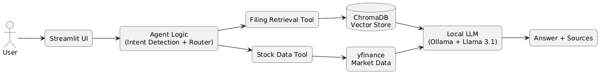
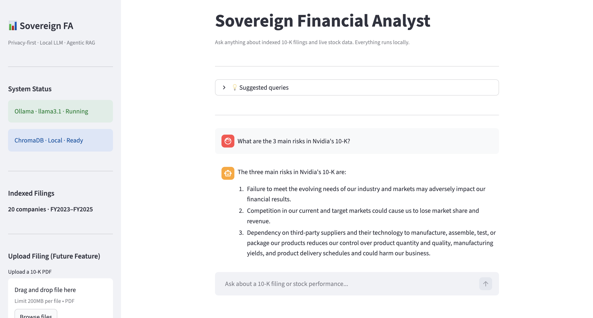
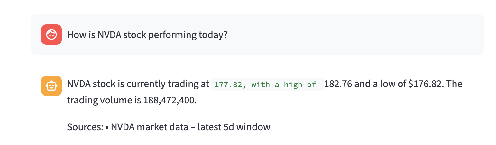
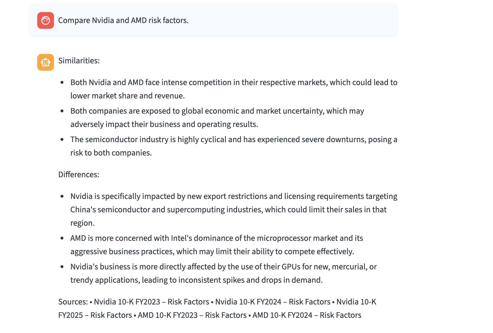

# Sovereign Financial Analyst


**Sovereign Financial Analyst** is a **local AI financial research assistant** that analyzes **SEC 10-K filings** and **live stock data** using a **rule-based orchestration layer with LLM synthesis** on top of a **Retrieval-Augmented Generation (RAG) pipeline**.

The system allows users to ask natural language questions about corporate filings such as:

- Risk factors
- Revenue trends
- Business segments
- Financial performance
- Cross-company comparisons

All inference runs **locally** using **Ollama + Llama 3.1**, ensuring privacy and zero external API calls.

---

# Features

## Rule-Based Query Routing

Keyword and regex matching in `app/agent.py` automatically determines which tools to call based on the query:

- **10-K filing retrieval**
- **Live stock data**
- **Section-specific analysis**
- **Multi-company comparison**

---

## Section-Aware 10-K Retrieval

Instead of searching entire filings, the system retrieves specific sections:

- Risk Factors
- MD&A (Management Discussion & Analysis)
- Business Overview
- Financial Statements

This improves retrieval precision and reduces hallucinations.

---

## Live Stock Data Integration

The system integrates **live market data** using `yfinance` to answer questions like:

- Current stock price
- Trading range
- Volume

---

## Cross-Company Comparison

Users can compare companies directly.

Example:

```text
Compare Nvidia and AMD risk factors.
```

The agent retrieves relevant sections from both filings and generates a structured comparison.

---

## Grounded Citations

All answers include **citations from the original filings**, such as:

```text
Sources:
• Nvidia 10-K FY2024 – Risk Factors
• Nvidia 10-K FY2023 – MD&A
```

---

## Fully Local AI Stack

The entire system runs locally:

- No external APIs
- No data leaving your machine
- Full privacy

---

# System Architecture


Sovereign Financial Analyst uses a local RAG pipeline with rule-based orchestration to answer financial questions from SEC 10-K filings and live market data.

- The **Streamlit UI** accepts user queries
- The **Rule-Based Router** (`app/agent.py`) identifies the company, intent, and required tools via keyword/regex matching
- The **Filing Retrieval Tool** queries section-aware 10-K embeddings stored in **ChromaDB**
- The **Stock Data Tool** retrieves current market information through **yfinance**
- Retrieved context is passed to a **local LLM (Ollama + Llama 3.1)**
- The model generates a grounded response with **citations**

# Dataset

The system currently indexes **20 public companies** including:

- Nvidia
- Apple
- Microsoft
- Amazon
- Tesla
- Meta
- AMD
- Boeing
- Goldman Sachs
- Walmart

Filings included:

- FY2023
- FY2024
- FY2025

All filings are stored locally and processed into vector embeddings.

---

# Example Queries

### Risk Analysis

```text
What are the 3 main risks in Nvidia's 10-K?
```

### Financial Trend Analysis

```text
What is Nvidia's revenue trend from the filing?
```

### Stock Performance

```text
How is NVDA stock performing today?
```

### Cross-Company Comparison

```text
Compare Nvidia and AMD risk factors.
```

---

# UI Preview

Below are sample interactions from the application.

### Risk Analysis

Shows section-aware retrieval from Nvidia's 10-K.



### Stock Data

Shows live NVDA market data retrieved through the stock data tool.



### Company Comparison

Shows cross-company comparison of Nvidia and AMD risk factors.



---

# Tech Stack

### AI / ML

- Ollama
- Llama 3.1
- LangChain

### Retrieval

- ChromaDB
- Sentence Transformers
- `all-MiniLM-L6-v2`

### Data Sources

- SEC 10-K Filings
- Yahoo Finance (`yfinance`)

### Backend

- Python

### Interface

- Streamlit

---

# Installation

Clone the repository:

```bash
git clone https://github.com/Siddharth-16/Sovereign-Financial-Analyst.git
cd sovereign-financial-analyst
```

Create a virtual environment:

```bash
python -m venv venv
source venv/bin/activate
```

Install dependencies:

```bash
pip install -r requirements.txt
```

---

# Start the Local LLM

Install and run Ollama:

https://ollama.ai

Pull the model:

```bash
ollama pull llama3.1
```

---

# Download SEC Filings

```bash
python scripts/data.py
```

---

# Build the Vector Database

```bash
python scripts/ingest.py
```

---

# Verify Ingestion Coverage

Section splitting relies on exact heading-string matches, which can fail silently on
filings with non-standard HTML formatting. After ingesting, confirm every company x
fiscal year actually produced all 4 sections:

```bash
python scripts/check_coverage.py
```

---

# Run the Application

```bash
streamlit run ui/ui.py
```

---

# Deployment

The FastAPI service (`api/main.py`) and the Streamlit UI are containerized separately from the same `Dockerfile` (multi-stage, `api` and `ui` targets), so either can be deployed independently of the other.

## Run locally with Docker Compose

Brings up Ollama, the FastAPI service, and the Streamlit UI together, wired to each other:

```bash
cp .env.example .env        # fill in SEC_API_KEY if you plan to (re)ingest
docker compose up --build
```

First run only -- pull the model into the shared Ollama volume:

```bash
docker compose run --rm ollama-pull
```

- API: http://localhost:8000/docs
- UI: http://localhost:8501

The `chroma_data` volume starts empty. Either populate it by running `scripts/ingest.py` against a mounted `data/raw`, or build the image with a local `chroma_db/` already present (see below) so it's baked in.

## Build a single image

```bash
docker build --target api -t sovereign-fa-api .
docker build --target ui  -t sovereign-fa-ui .
```

If a `chroma_db/` directory exists locally (i.e. you already ran ingestion), it's copied into the image automatically. Otherwise, mount a populated one at runtime:

```bash
docker run -p 8000:8000 \
  -e LLM_PROVIDER=ollama -e OLLAMA_BASE_URL=http://host.docker.internal:11434 \
  -v $(pwd)/chroma_db:/srv/chroma_db \
  sovereign-fa-api
```

## Public demo (Render -- no credit card required)

The roadmap's lower-effort path -- a live public URL with minimal infra setup, using hosted inference (Groq) instead of Ollama since a public link can't require visitors to run a local model. Render's free web service tier doesn't require billing details to get started (it does sleep after 15 min of inactivity and takes 30-60s to wake back up on the next request -- fine for a portfolio demo).

1. Push this repo to GitHub if it isn't already.
2. In the [Render dashboard](https://dashboard.render.com): **New -> Blueprint** -> connect the repo. Render reads `render.yaml` and creates the service automatically.
3. When prompted, enter `GROQ_API_KEY` (from [console.groq.com](https://console.groq.com)) and `SEC_API_KEY`. These are the two vars marked `sync: false` in `render.yaml` -- Render asks for them once in the dashboard rather than storing them in the repo.
4. Render builds `Dockerfile` directly (defaulting to the last stage, `api` -- see the comment in the Dockerfile) and deploys.

**Check it's live:**

```bash
curl https://<your-service>.onrender.com/health
```

### Alternative: Fly.io

`fly.toml` is also included if you'd rather use Fly instead (requires a card on file, but scales to zero machines when idle to keep cost near-zero):

```bash
flyctl launch --no-deploy --copy-config --name sovereign-financial-analyst
flyctl secrets set GROQ_API_KEY=... SEC_API_KEY=...
flyctl deploy --dockerfile Dockerfile --build-target api
```

## CI/CD

`.github/workflows/ci-cd.yml` runs on every push/PR:

1. **Lint** -- `ruff check` (pyflakes rules: undefined names, unused imports, syntax errors)
2. **Test** -- the pytest suite (68 tests, no external services required)
3. **Deploy** -- on push to `main` only, after tests pass: triggers Render's deploy hook

Render builds directly from this GitHub repo on its own infrastructure, so no image registry/push step is needed. Render's dashboard has an "Auto-Deploy" toggle that deploys on every push regardless of CI status; the workflow instead triggers a deploy explicitly via a Deploy Hook once tests pass, so a broken push never gets deployed. To use this: **service -> Settings -> Deploy Hook** in the Render dashboard, copy the URL, and add it as a repo secret named `RENDER_DEPLOY_HOOK_URL` (**GitHub repo -> Settings -> Secrets and variables -> Actions**). If you'd rather rely on Render's own auto-deploy instead, leave that secret unset -- the deploy job will just fail harmlessly and Render will have already deployed on its own.

## Environment variables

See `.env.example` for the full list. The ones that matter for deployment specifically:

| Variable           | Default                  | Notes                                                                                             |
| ------------------ | ------------------------ | ------------------------------------------------------------------------------------------------- |
| `LLM_PROVIDER`     | `ollama`                 | `ollama` for local/private, `groq` for the public demo                                            |
| `OLLAMA_BASE_URL`  | `http://localhost:11434` | Set to `http://ollama:11434` in docker-compose                                                    |
| `GROQ_API_KEY`     | --                       | Required only when `LLM_PROVIDER=groq`                                                            |
| `CHROMA_PATH`      | `./chroma_db`            | Point at a mounted volume in containerized setups                                                 |
| `CHROMA_S3_BUCKET` | --                       | Optional: sync a pre-built index from S3 on container startup instead of baking it into the image |

---

# Project Structure

```
sovereign-financial-analyst/

app/
   agent.py          # rule-based query routing + LLM synthesis
   agentic_router.py # LLM tool-calling routing (mode="agentic")
   llm.py            # LLM provider factory (ollama / groq)
   tools.py          # retrieval + stock tools
   config.py         # configuration
   companies.py      # single source of truth: company/ticker/section data

api/
   main.py           # FastAPI service

data/
   raw/              # raw 10-K filings

ui/
   ui.py             # Streamlit interface

scripts/
   ingest.py            # filing ingestion pipeline
   data.py              # download SEC 10-K filings using SEC API
   check_coverage.py    # verifies ingestion produced all companies x years x sections
   sync_chroma.py       # optional: pull a pre-built chroma_db from S3 on container start

docker/
   entrypoint-api.sh    # api container entrypoint (optional S3 sync -> uvicorn)
   entrypoint-ui.sh      # ui container entrypoint (optional S3 sync -> streamlit)
```

---

# Future Improvements

Possible extensions:

- **True LLM-driven tool-calling** (LangChain tool-calling agent) to replace the current keyword/regex router
- Dynamic **PDF ingestion from the UI**
- **Financial metric extraction**
- **SEC filing summarization**
- **Vector reranking**
- **Historical trend visualizations**
- **Earnings call transcript analysis**

---

# License

MIT License

---

# Why This Project

Financial filings contain **critical information for investors and analysts**, but they are extremely long and difficult to navigate.

This project demonstrates how **RAG + rule-based orchestration** can transform complex regulatory filings into **interactive financial intelligence**.
